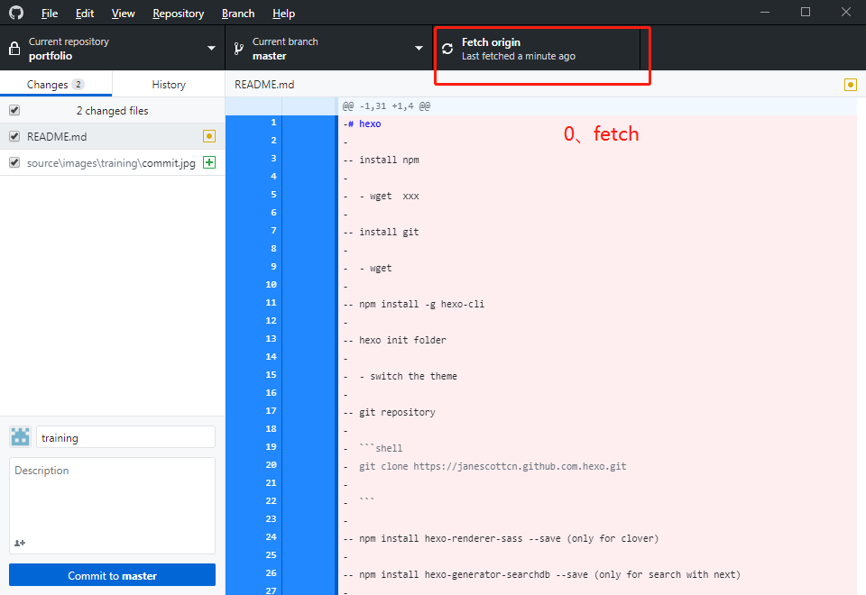
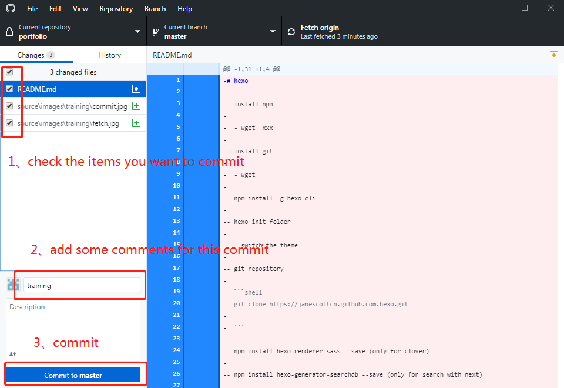
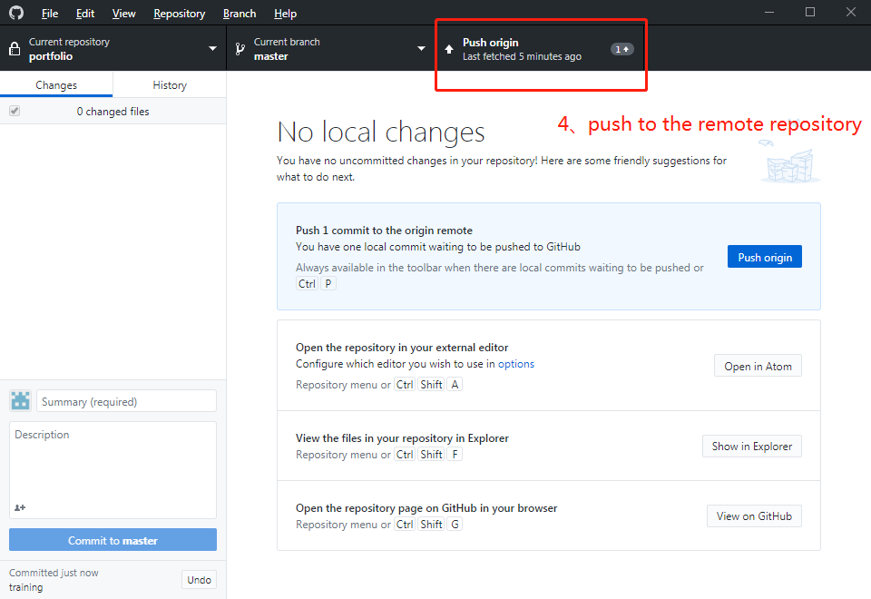

#repository

- scott repository
  - scaffolds (this is for layout, like post draft)
  
  - source (this is for post, image, tags, categories)
  
  - _config.yml
  
  - readme.md
- theme repository (next)
  - _config.yml (for theme config)
  - readme.md (for the dependencies)
  - layout (custom change)
  - scripts
  - source
    - css
    - fonts
    - images
    - js
    - lib (do not contain)

# step

- step 0: setting environment
  
  ```shell
  install npm
  install git
  npm install -g hexo-cli
  ```
  
  
  
- step 1: init hexo

  ```shell
  hexo init <folder>
  cd <folder>
  rm -rf scaffolds/ source/ _config.yml package.json README.md .gitignore package-lock.json db.json README.md
  git init
  git remote -v
  git remote add origin git@github.com:janescottcn/scott.git
  git remote set-url origin git@github.com:janescottcn/scott.git
  git remote add origin https://github.com/janescottcn/scott.git
  git remote set-url origin https://github.com/janescottcn/scott.git
  git pull
  git branch --set-upstream-to origin/master master
  ```

  

- step 2: change the theme

  > ```shell
  > git clone https://github.com/theme-next/hexo-theme-next themes/next
  > cd themes/next
  > rm -rf layout/ scripts/ source/css source/fonts source/images source/js .github README.md .gitignore _config.yml package.json languages/
  > rm -rf .git .gitattributes
  > git init
  > git remote add origin https://github.com/janescottcn/next.git
  > git remote add origin git@github.com:janescottcn/next.git
  > git pull origin master
  > git branch --set-upstream-to origin/master master
  > ```

- step 3: add dependencies

  > ``` shell
  > git clone https://github.com/theme-next/theme-next-reading-progress source/lib/reading_progress
  >git clone https://github.com/theme-next/theme-next-pace source/lib/pace
  > git clone https://github.com/theme-next/theme-next-canvas-nest source/lib/canvas-nest
  > ```


## how to write post

- step 0: software

  - install git
  - install github desktop
  - install typora for markdown

- step 1:  init repository

  ```shell
  git clone https://github.com/janescottcn/scott.git posts
  ```

- step 2: write

  - you can upload your images into **source/images**
  - you can create post in **source/_posts**
  - you can modify about post in **source/about/index.md**

- step 2: upload

  - open github desktop, add the repository and connect this repository with remote repository

  - fetch origin

    

  - commit posts

    

  - push to the remote repository

    